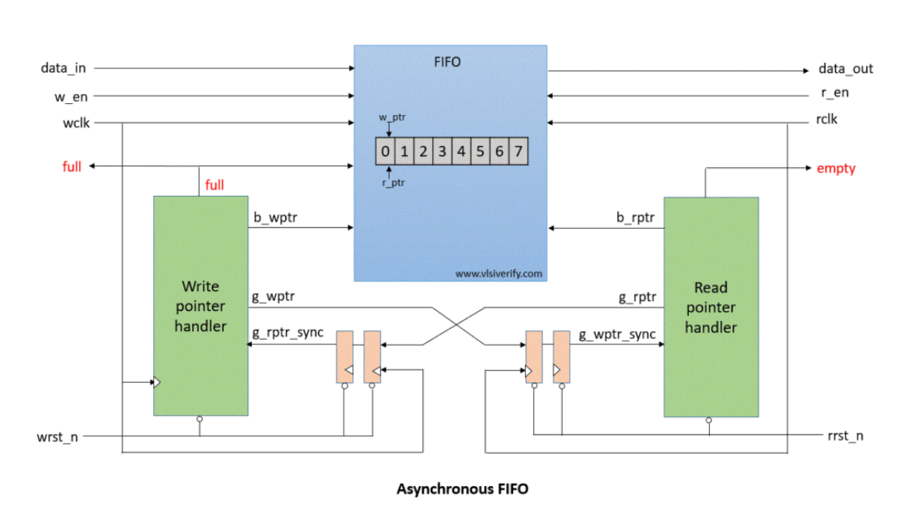
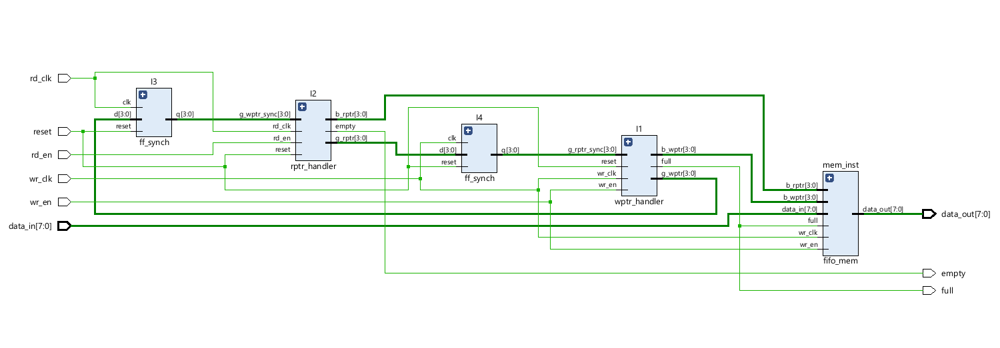
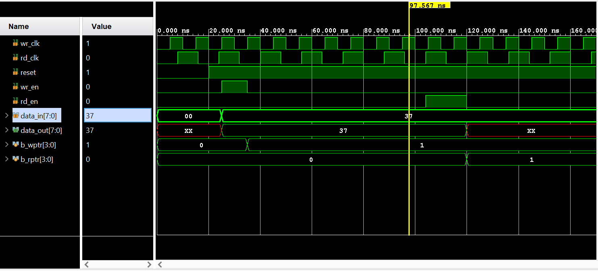

# Asynchronous FIFO using SystemVerilog

## Overview

This project implements a parameterized **Asynchronous FIFO** in **SystemVerilog**.

Unlike a synchronous FIFO, an asynchronous FIFO allows data transfer between two independent clock domains by using Gray code pointers and two-stage synchronizers to safely handle clock domain crossing (CDC).

The design includes separate read and write pointer handlers, Gray code conversion, pointer synchronization, FIFO memory, and a comprehensive testbench for functional verification.

---

## Features

- Parameterized FIFO depth and data width
- Independent read and write clocks
- Binary to Gray code conversion
- Two Flip-Flop (2FF) synchronizers
- Safe clock domain crossing (CDC)
- Full and Empty flag generation
- Separate FIFO memory module
- SystemVerilog implementation
- Functional simulation and waveform verification

---

## Project Structure

```
Async_FIFO/
│
├── rtl/
│   ├── bcgc.sv
│   ├── ff_synch.sv
│   ├── wptr_handler.sv
│   ├── rptr_handler.sv
│   ├── fifo_mem.sv
│   └── fifo_top_module.sv
│
├── tb/
│   └── fifo_top_module_tb.sv
│
├── images/
│   ├── block_diagram.png
│   ├── rtl_schematic.png
│   └── simulation_waveform.png
│
├── simulation_log.txt
│
└── README.md
```

---

# Architecture

The asynchronous FIFO consists of the following modules:

### 1. Binary to Gray Code Converter (`bcgc.sv`)

Converts binary pointers into Gray code.

Gray code ensures that only one bit changes during pointer transitions, reducing the possibility of metastability during clock domain crossing.

---

### 2. Two Flip-Flop Synchronizer (`ff_synch.sv`)

Synchronizes Gray-coded pointers across different clock domains using two cascaded flip-flops.

This greatly reduces the probability of metastability.

---

### 3. Write Pointer Handler (`wptr_handler.sv`)

Responsible for:

- Maintaining the binary write pointer
- Generating the Gray code write pointer
- Detecting FIFO Full condition

---

### 4. Read Pointer Handler (`rptr_handler.sv`)

Responsible for:

- Maintaining the binary read pointer
- Generating the Gray code read pointer
- Detecting FIFO Empty condition

---

### 5. FIFO Memory (`fifo_mem.sv`)

Implements the memory array.

- Synchronous write operation
- Asynchronous read operation

---

### 6. Top Module (`fifo_top_module.sv`)

Integrates all modules together:

- Write pointer handler
- Read pointer handler
- Synchronizers
- FIFO memory

---

## Block Diagram



---

## RTL Schematic



---

## Simulation

The design was verified using a SystemVerilog testbench.

The following scenarios were tested:

- Reset operation
- Single write and read
- Multiple write operations
- Multiple read operations
- FIFO Full detection
- FIFO Empty detection
- Independent read and write clocks
- Clock domain crossing through Gray code synchronization

Simulation outputs are available in:

- `simulation_log.txt`

Waveform:



---

## Parameters

| Parameter | Description | Default |
|-----------|-------------|---------|
| DEPTH | FIFO Depth | 8 |
| WIDTH | Data Width | 8 |
| ptr_size | Pointer Width | 4 |

---

## Tools Used

- SystemVerilog
- Vivado Simulator (XSim)
- Vivado RTL Schematic Viewer

---

## Concepts Demonstrated

- Asynchronous FIFO Design
- Clock Domain Crossing (CDC)
- Metastability Mitigation
- Two Flip-Flop Synchronizer
- Binary to Gray Code Conversion
- Pointer Synchronization
- Full/Empty Flag Generation
- Parameterized RTL Design

---

## Future Improvements

Some possible enhancements include:

- Assertion-based verification (SVA)
- Functional coverage
- UVM-based verification environment
- Almost Full and Almost Empty flags
- Configurable FIFO depth
- FPGA implementation and hardware validation

---

## Learning Outcomes

This project helped strengthen my understanding of:

- Clock domain crossing techniques
- Gray code pointers
- Two-stage synchronizers
- FIFO architecture
- Parameterized RTL design in SystemVerilog
- Functional verification using testbenches

---

## Author

**Ananya Satish**

Electronics and Communication Engineering (ECE)

Interested in Digital Design, Functional Verification, and VLSI.
